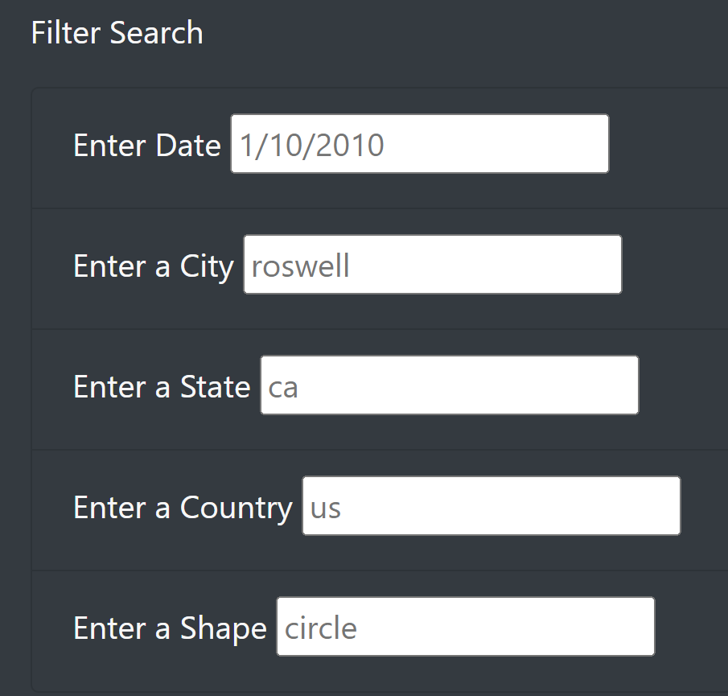
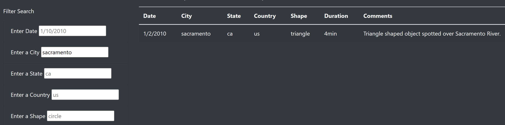

# UFOs

## Purpose
The purpose of this project was to create a site using a large data set of UFO sighting information. The goal was to create a table holding the data, along with multiple options for the user to filter the data.

## Results
The UFO data is able to be filtered by Date, City, State, Country, and Shape. You can see the filter box below, showing all of the fields which can be filled in to filter the data.

The user needs to input data into one of these fields, and either press enter or tab to apply the filter. They can filter by multiple criteria in order to drill down to specific data. Below is an example of the city field being filtered by “sacramento”.

## Summary
There are two drawbacks with the filtering process.  The first is that the filter criteria is case sensitive, and the data is all lowercase. This means that if you enter a city, state, or country with the proper capitalization, the filter will return no results even if there are matches. This should be adjusted to accept an input regardless of case.

The 2nd is that the user cannot tell what specific options are available. For example, they have no way of knowing which cities contain data, so could filter for multiple cities that are not available before finally finding one with data. A solution that would solve this problem is to use a drop down list for filtering, which contains only the options that have data. This would make it much more user friendly.
